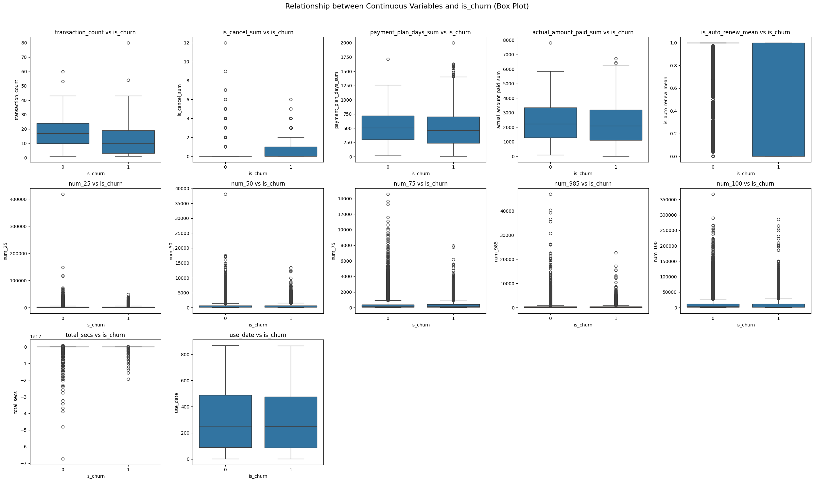
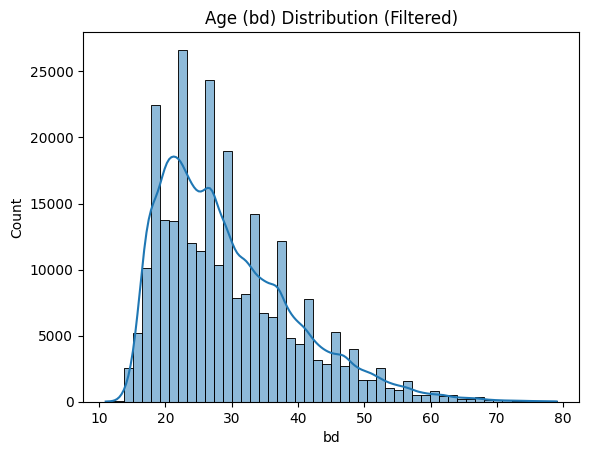
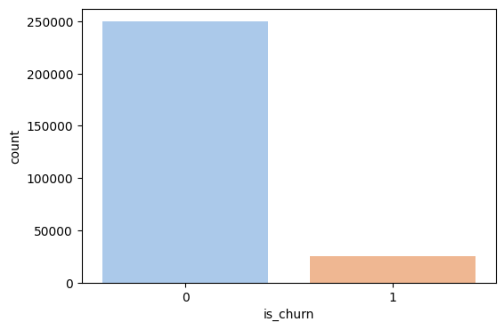
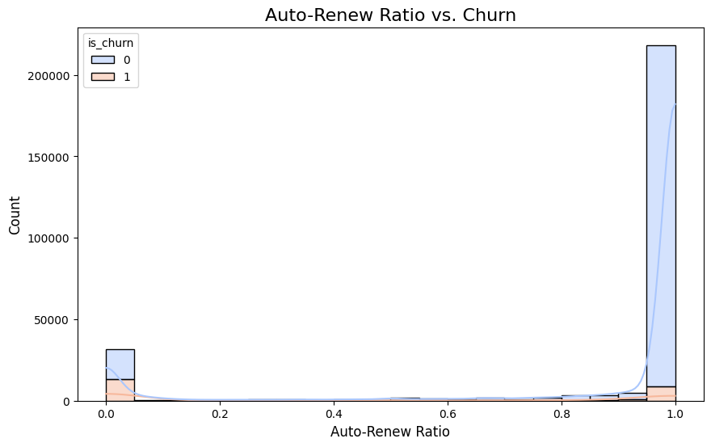
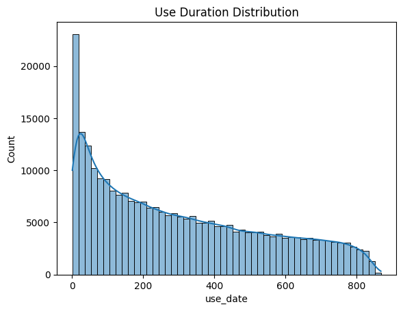
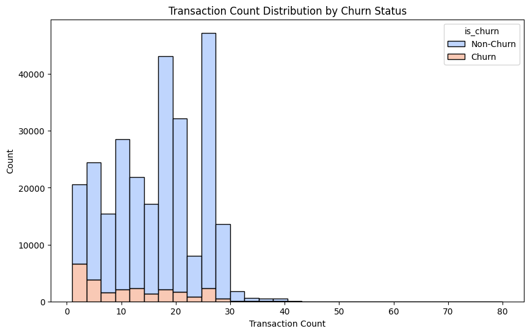
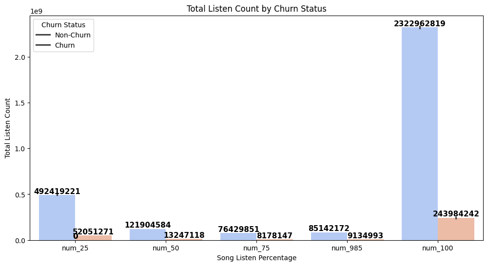
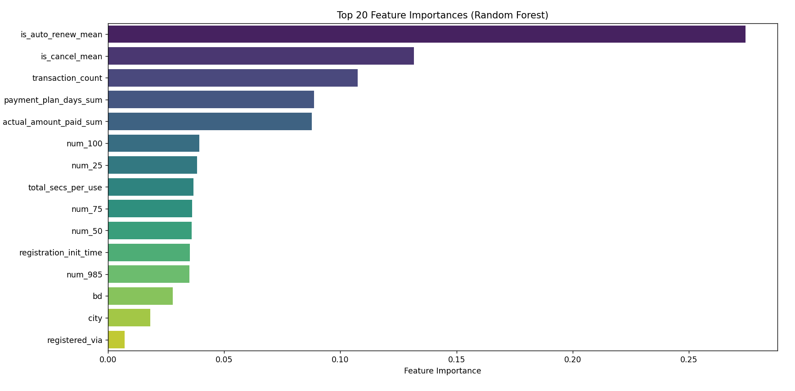

# 🎵 KKBox(대만 음악 스트리밍 서비스) 사용자 이탈 예측 프로젝트
## Member
<table>
  <thead>
    <td align="center">
         

        김장수
      </a> 
    </td>
    <td align="center">
         

        방성일
      </a> 
    </td>
    <td align="center">
         

        배정수
      </a> 
    </td>
    <td align="center">
      <a href="">
         

        이현대
      </a> 
    </td>
      <td align="center">
      <a href="https://github.com/minjung2266">
         

        이민정
      </a> 
    </td>
  </thead>
</table>

---
##  🎯 프로젝트 개요
### 📅 개발 기간
**2025.03.31 ~ 2025.04.01 (총 2일)**

### **프로젝트 목표**
- KKBox(대만 음악 스트리밍 서비스) 사용자의 **이탈 여부(is_churn)** 를 예측하는 모델을 개발하여, KKBox 사용자의 이탈 방지를 효과적으로 수행하여 수익 향상에 기여함을 목적으로 함.

### **기대효과**:

 1. **수익 손실 방지**  
   신규 고객 확보 비용은 기존 고객을 유지하는 비용보다 높음. 따라서 기존 고객의 이탈을 줄이는 것이 비용적인 면에서 효율적.

2. **고객 충성도 향상**  
   고객 이탈 가능성이 높은 고객을 조기에 식별하여 맞춤형 유지 전략을 제공 -> 고객 충성도를 높여 장기적으로 더 높은 매출 창출이 가능

3. **비즈니스 프로세스 개선**  
   고객 이탈 데이터를 분석하여 제품, 서비스, 또는 마케팅 전략에서 개선이 필요한 부분을 파악 가능.

4. **마케팅 리소스 최적화**  
   이탈 가능성이 높은 고객에 집중하여 고객 유지 차원에서 마케팅 자원을 효율적으로 배분 가능. 이는 기업의 ROI(투자 대비 효과) 향상으로 연결됨.

### **접근 방식**:
  - 데이터를 목적에 맞게 전처리를 진행하고 여러 모델 중 학습 후 성능이 좋은 모델을 바탕으로, 이탈 여부에 큰 영향을 미치는 feature들을 시각화(그래프 등)를 통해 확인함. 이를 통해 KKBox에 제공할 수 있는 인사이트를 도출
   

### WBS

| 내용                     | 기간                  | 담당            |
|--------------------------|----------------------|---------------|
| 프로젝트 주제 설정        | 25.03.31 - 25.03.31  | ALL           |
| 데이터 수집              | 25.03.31 - 25.03.31  | ALL           |
| 데이터 EDA     | 25.03.31 - 25.03.31  | ALL           |
| 데이터 전처리    | 25.03.31 - 25.03.31  | ALL           |
| 모델 선정    | 25.03.31 - 25.03.31  | ALL           |
| 모델 학습 및 평가        | 25.03.31 - 25.04.01  | ALL |
|  README 작성    | 25.03.31 - 25.04.01  | ALL           |
|  발표 준비    | 25.04.01 - 25.04.01  | ALL           |

## 📂데이터 구성
### - 데이터소스: [WSDM - KKBox의 Churn Prediction Challenge](https://www.kaggle.com/c/kkbox-churn-prediction-challenge/overview)
#### [ DataSet : 전처리 전]

1. members_v3.csv (유저 테이블)
    - **설명**: 유저의 프로필 정보
    - **컬럼**
        - `msno`: 유저 ID
        - `city`: 도시
        - `bd`: 나이 
        - `gender`: 성별
        - `registered_via`: 가입 경로
        - `registration_init_time`: 가입 날짜 (`%Y%m%d`)
2. train_v2.csv / train1.csv
    - **설명**: 유저 ID와 이탈 여부(`is_churn`)가 포함된 학습용 데이터셋 (2017년 2월까지의 데이터 기반)
    - **컬럼**
        - `msno`: 유저 ID
        - `is_churn`: 이탈 여부 ('1' = 이탈 o, '0' = 이탈 x)
3.  transactions.csv / transactions_v2.csv 
    - **설명**: 유저의 **결제 이력**이 담긴 데이터셋
    - **컬럼**
        - `msno`: 유저 ID
        - `payment_method_id`: 결제 방식 ID x
        - `payment_plan_days`: 플랜 기간 (일 기준)   sum
        - `plan_list_price`: 플랜 정가 (NTD)  mean/sum
        - `actual_amount_paid`: 실제 결제 금액 (NTD). mean/sum
        - discount_amout : 할인율 1 - (actual_amount_pain / plan_list_price).  mean/sum
        - `is_auto_renew`: 자동 갱신 여부
        - `transaction_date`: 결제 날짜 (`%Y%m%d`)
        - `membership_expire_date`: 회원 만료일 (`%Y%m%d`)
        - `is_cancel`: 구독 취소 여부

4.  user_logs.csv / user_logs_v2.csv
    - **설명**: 유저의 **일일 음악 재생 로그**를 담은 데이터셋 (2017년 2월까지).
    - **컬럼**
      - `msno`: 유저 ID
      - `date`:  `%Y%m%d` 형식의 날짜
      - `num_25`: 25% 미만 청취 된 노래의 개수
      - `num_50`: 25 ~ 50% 청취 된 노래의 개수
      - `num_75`: 50 ~ 75% 청취 된 노래의 개수
      - `num_985`: 75 ~ 98.5% 청취 된 노래의 개수
      - `num_100`: 98.5~100% 청취 된 노래의 개수
      - `num_unq`: 청취한 노래의 개수
      - `total_secs`: 총 재생 시간(초)

### TechSet

  
  
  

  
  
  

  

### EDA
#### 데이터 전처리 

#### user_log.csv 에 대한 데이터 전처리 내용
1. 28GB였던 유저 로그 데이터를 1.1GB 크기의 26개 파일로 분리  
2. member 테이블을 라벨인코딩하여 key-value 형태의 JSON으로 저장  
3. 분리된 파일의 user_log 데이터를 `msno`를 기준으로 매핑  
4. 각 user_log 내 중복되는 `userId(msno)`를 Groupby하여 중복 제거  
   - 이후, `use_date`(노래를 들은 날짜), `start_date`(처음 들은 날), `end_date`(마지막 들은 날) 컬럼 추가  
5. 모든 user_log를 하나로 합친 후 다시 Groupby하여 4번과 동일한 과정 진행  

 #### transaction_v2.csv 에 대한 전처리 내용
 - transaction_date_check.py
   
 캐글의 데이터 설명에 명시된 내용을 보면 transaction.csv 파일은 2017년 02월 28일 까지의 거래 기록, transaction_v2.csv 파일은 그 이후로 2017년 03월 31일 까지의 거래 기록으로 확인된다. 
 하지만 transaction_v2.csv 파일의 'transaction_date' 컬럼을 보면 거래일자가 20170228~20170331 이외의 데이터들이 섞여있어서 이상치로 판단 후 제거 
     
 결과 : filtered_transactions_v2.csv 데이터 개수 : 1431009  -> 1150924   
 
 - labelmapping.py
 
 msno 값을 label 인코딩 해둔 members_encoded.csv 파일을 불러와 filtered_transactions_v2.csv 파일에 적용하여 
 msno 값을 숫자로 변환하고, members_v3.csv (유저정보) 에 없는 msno 값을 가진 데이터를 제거 
 
 결과 : filter_and_labeled_transactions_v2.csv 데이터 개수 : 1150924 -> 1027895   
 
     
 ##### transaction.csv 에 대한 전처리 내용 
 - labelmapping.py
 msno 값을 label 인코딩 해둔 members_encoded.csv 파일을 불러와 filtered_transactions.csv 파일에 적용 
 msno 값을 숫자로 변환하고, members_v3.csv (유저정보) 에 없는 msno 값을 가진 데이터를 제거 
 
 결과 : labeled_transactions.csv 데이터 개수 : 21547745 -> 18891703   
 
 
 - concat.py
     
 filter_and_labeled_transactions_v2.csv 와 labeled_transactions.csv 를 concat 
     
 결과 : merged_transactions.csv 데이터 개수 : 1027895 + 18891703 -> 19919598   
 
 
 - merged_transactions_preprocessing.py
 
 merged_transactions.csv 에서 transaction_date 가 membership_expire_date 보다 큰 값(이상치) 제거. 
 
 결과 :  final_merged_transactions.csv 데이터 개수 : 19919598  -> 19779157   
 
 
 - transaction_processing.py
     
 final_merged_transactions.csv 에서 msno_encoded의 타입을 int 형으로 바꾸고 컬럼명을 'msno'로 저장 후, msno_encoded 컬럼 제거.
 
 merged_transactions.csv 파일의 컬럼 중. 
 1)payment_list_price 보다 actual_amount_paid 가 큰 데이터 들을 제거 
 2)payment_plan_id 컬럼 제거 
  
 msno_encoded를 기준으로 그룹화 해서
 
 0)transaction_date 값 중 max 값을 저장.  
 1)거래 횟수를 저장해두는 transaction_count 컬럼 생성 
 2)is_cancel 의 수를 저장해두는 is_cancel_sum 컬럼 생성 
 3)is_cancel 의 평균을 저장해두는 is_cancel_mean 컬럼 생성 
 4)actual_amount_paid의 총합을 저장하는 actual_amount_paid_sum 컬럼 생성 
 5)is_auto_renew 의 평균을 저장한 is_auto_renew_mean 컬럼 생성 
 6)is_cancel == 0 인 데이터만 필터링하여 plan_days_sum 컬럼 생성 (구독 취소하는 경우의 plan_days를 세지 않기 위함) 
 
 추가)  
 actual_amount_paid_sum 값이 0 초과인 데이터만 추출(기간 동안 총 결제 금액이 0인 유저 제거 위함)
     
 결과 : final_processed_transactions.csv  데이터 개수 : 19919598 -> 1551863   
 
 
 ##### members_v3.csv 에 대한 전처리 내용 
     
 - member_preprocessing.py
 members_encoded2.csv(members_v3 파일에서 msno값을 labelencoding 한 데이터)의 데이터 개수가 6769473, 이중 gender의 결측치가  4429505 개로 확인되어 gender 컬럼 제거 
 
 결과 : final_members.csv 데이터 개수 : 6769473   
 
 
 ##### members_v3.csv + final_processed_transactions.csv 병합 후 전처리
 - merge_transac+member.py
 final_members.csv 파일과 final_processed_transactions.csv 파일을 msno를 기준으로 병합 
 
 결과 :  merged_member_transaction_data.csv 데이터 개수 : 1551864   
 
 
 - preprocessing_member_transaction.py
 registration_init_time > transaction_date_max 인 데이터 제거 
 
 결과 :  데이터 개수 : 1551863 -> 1340063   
 
 
 ##### train_encoded.csv + final_merged_member_transaction_data.csv + user_logs_encoded_merged_all.csv 병합
 -merge_final.py
 train_encoded.csv + final_merged_member_transaction_data.csv + user_logs_encoded_merged_all.csv 세 개의 파일을 'msno' 기준으로 병합
 
 결과 : realrealreal_final_data.csv  데이터 개수 : 839941   
 
     
 -rrrr_final.py
 
 
 
 bd(나이) 10세 이상 80세 이하인 데이터만 추출
     
 결과 : rrrr_final_data.csv 데이터 개수 : 839941 -> 275465   
 
 ### UnderSampling 적용 
 **오버샘플링이 아닌 언더샘플링 적용 이유**
 - 이탈 사용자의 데이터 개수가 전처리 후 25612개로 충분하다고 판단
 - 오버샘플링을 하며 인위적인 데이터를 만드는 것보다 원본 데이터를 유지하며 학습하는 것이 더 신뢰도가 있을 것이라 판단  
   
 rrrr_final_data.csv 의 데이터 비율은 아래와 같다. 
     
 is_churn 
 0    249853 
 1     25612 
 
 약 10:1 로, 데이터 불균형이 상당하여 3:1로 조정하여 언더샘플링을 진행했다. 
 - 판단 기준 (https://www.dbpia.co.kr/journal/detail?nodeId=T15485105) (https://www.kci.go.kr/kciportal/ci/sereArticleSearch/ciSereArtiView.kci?sereArticleSearchBean.artiId=ART001273099) 
 
 -undersampling.py
   
 is_churn 
 0    76836 
 1    25612 
 
 결과 : undersampling_3_1_data.csv   
 
 
 -undersam_preprocessing.py  
 'actual_amount_paid_sum'을 'transaction_count'로 나눈 새로운 컬럼 추가
 'payment_plan_days_sum'을 'transaction_count'로 나눈 새로운 컬럼 추가
 
 결과 : 2_undersampling_3_1_data.csv   

##### [ DataSet : 최종 데이터]
| 컬럼명                   | 설명                                                                |
|------------------------|---------------------------------------------------------------------------|
| `msno`                 | 사용자 고유 ID                                                              |
| `is_churn`             | 이탈 여부 (1: 이탈, 0: 유지)                                                 |
| `city`                 | 사용자의 도시 (지역 정보)                                                    |
| `bd`                   | 사용자의 나이 (birth date에서 유추)                                          |
| `registered_via`       | 등록 경로 (앱, 웹, 페이스북 등)                                              |
| `registration_init_time` | 가입한 날짜 (YYYYMMDD 형식)                                                |
| `transaction_count`    | 총 거래 횟수                                                                 |
| `is_cancel_mean`       | 평균적으로 거래가 취소된 비율                                                 |
| `is_auto_renew_mean`   | 자동 갱신 여부 평균 (1: 자동 갱신됨, 0: 아님)                                 |
| `payment_plan_days_sum` | 전체 결제 플랜 일수 합                                                       |
| `num_25`               | 25% 정도 감상한 곡 수                                                         |
| `num_50`               | 50% 정도 감상한 곡 수                                                         |
| `num_75`               | 75% 정도 감상한 곡 수                                                         |
| `num_985`              | 거의 끝까지 (98.5%) 감상한 곡 수                                              |
| `num_100`              | 100% 감상한 곡 수                                                             |
| `total_secs`           | 전체 감상 시간(초 단위)                                                       |
| `use_date`             | 해당 사용자의 데이터가 몇 개의 날짜에 걸쳐 있는지 (사용일 수)                 |

### 데이터 시각화 

     
---
### 인공지능 학습 결과

#### 하이퍼 파라미터 (RandomSearchCV)
- 대용량 데이터를 학습하는데 시간이 많이 소요되어 RandomSearchCV 사용 

- 최적의 파라미터 
  

#### Model Performance (Before & After Tuning)

| Model               | Accuracy (Before → After) | Precision (Before → After) | Recall (Before → After) | F1 Score (Before → After) | ROC AUC (Before → After) |
|--------------------|---------------------|----------------------|----------------|-----------------|----------------|
| **LogisticRegression** | 0.8319 → 0.8320  | 0.6814 → 0.6815  | 0.6140 → 0.6142 | 0.6459 → 0.6461  | 0.8739 → 0.8743 |
| **RandomForest**      | 0.8601 → 0.9618  | 0.7606 → 0.9811  | 0.6416 → 0.8638 | 0.6960 → 0.9187  | 0.9190 → 0.9896 |
| **XGBoost**           | 0.8623 → 0.8907  | 0.7565 → 0.8243  | 0.6613 → 0.7145 | 0.7057 → 0.7655  | 0.9225 → 0.9460 |
| **LightGBM**          | 0.8636 → 0.8808  | 0.7794 → 0.8180  | 0.6329 → 0.6721 | 0.6985 → 0.7379  | 0.9237 → 0.9388 |

#### 튜닝 후 모델별 성능 비교

#### 튜닝 후 ROC - CURVE

#### 모델 별 예측 데이터 수 
 

- 평가지표, ROC - CURVE 의 결과를 토대로 최종 모델을 **RandomForest**로 선정

#### 특성 중요도 

---
### Insights 및 결론
- 결제 취소율을 줄이기 위해서는 취소 정책을 더욱 강하게 하면 자동 결제율은 줄어들겠지만 이탈을 줄일 수 있다.
- 자동결제율이 높을수록 고객 이탈이 적은 경향을 보이는데, 이를 바탕으로 자동 결제율이 감소하는 문제를 해결하기 위해 자동결제를 유지하면 요금제 할인 등 프로모션을 진행하면 고객 이탈을 방지할 수 있다. 
---
### 한 줄 회고

| 팀원  |               한 줄 회고                 |
|-------|----------------------------|
| 정수  | 대용량 데이터를 처음 다뤄봐서 정제에만 시간이 오래 걸렸습니다. 여러 데이터 파일을 병합하고 정제하는 과정이 재미있었고, 분류 모델을 사용하며 과적합을 해결해보고자 여러 방법을 시도해봤지만 해결하지 못한 점과 인사이트 도출이 아쉬웠습니다 |
| 현대  | 대용량 실 데이터를 다룬 경험이 의미 있었다고 생각합니다.다만 데이터의 크기가 컸지만 로그 자체에 이상 데이터도 많았고 전처리에 더 많은 시간을 쓰지 못한점이 아쉬웠다  |
| 성일  | 여러 분류 모델과 데이터 전처리를 진행하며 수업하며 배운 내용들을 다질 수 있어 좋았다.  |
| 장수  | user_logs.csv 같은 경우에는 파일 크기가 약 30GB로, 데이터 개수만 3억 개가 넘기 때문에 VSCode 에서 파일을 불러오는 것 조차 거의 불가능했습니다. 따라서 이 파일을 분할하여 전처리를 진행했는데 새로운 경험이었고, 그 외의 파일에 대해서도 대용량 데이터를 처리하면서 고려해야 할 점이 많아서 흥미로웠습니다. 그리고 학습 할 때 시간이 많이 소요되었는데 학습 시간을 단축시키는 방법에 대해서도 앞으로 고민해보고 싶습니다.  |
| 민정  | 약 30GB에 달하는 user_log 데이터를 효율적으로 다루기 위해 다양한 전처리 전략을 시도했했지만, 하이퍼파라미터 튜닝에도 모델의 과적합이 해결되지 않아 아쉬웠습니다. 

  
